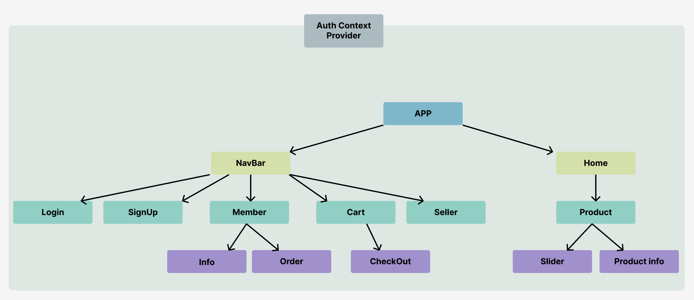
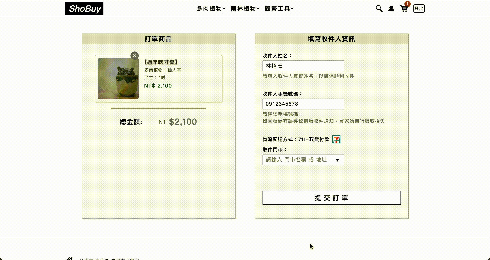

# ShoBuy

  
  <h4>Plant E-commerce official website</h4>
  <h4>Front-end & Back-end system</h4>

---

#### Website URL : https://shobuy-bc47c.web.app

#### Test account

- Email: test666@gmail.com
- Password: test666
---
## Components Tree

## Tech Table
| Skill             | Description                                                                  |
| :---------------  | :--------------------------------------------------------------------------- |
| React Hook        | useState useEffect useContext useReducer                                     |
| React Router      | SPA routing                                                                  |
| React Context     | Manage authentication global state on each component                         |
| SCSS              | Designing web pages, use mixin manage rwd                                    |
| Firebase          | Authentication: Authentication manage                                        |
|                   | Firestore: manage products members orders documents, realtime update data    |
|                   | Storage: Store all images                                                    |
|                   | Hosting: Deploy website                                                      |
| Git               | Version control                                                              |
| webpack           | Module bundler                                                               |
| Babel             | Compiler                                                                     |
| Prettier          | Manage coding style                                                          |

## Demo

## Front-end User

#### HomePage

- Dropdown menu
- Keyword searching
- Products sorted selection
- Showing different picture while mouse enter product
  

### MemberPage

- Login Signup function
- Sending reset password e-mail
- Update thumbnail and user's profile
- Showing user's orders
  
  

### ProductPage OrderPage and Cart function

- Image slider
- Add product to cart
- Select purchase quantity
- Web crawling all store data, display with datalist
  
  

## Back-end Manager

### UploadPage and delete product function

- Upload product image and information
- Delete product
- Manage all user's orders
  
  

## RWD 
- Dropdown menu to hamberber icon
- Searchbar animation
- Enable finger swipe on product image slider

  
  